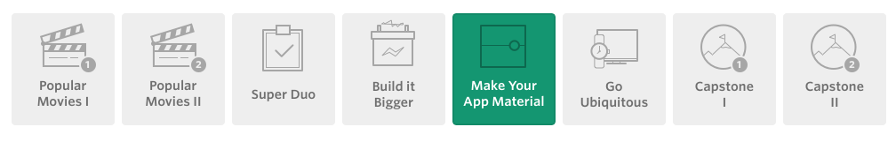

# XYZ Reader 
*Make Your App Material Design*

## Project Overview

In this project, you will redesign an app to follow the Material Design guidelines and translate a set of static design mocks to a living and breathing app.

## UI Review
### User Feedback for XYZ Reader:
**Lyla says:**

*“This app is starting to shape up but it feels a bit off in quite a few places. I can't put finger on it but it feels odd.”*

**Jay says:**

*“Is the text supposed to be so wonky and unreadable? It is not accessible to those of us without perfect vision."*

**Kagure says:**

*“The color scheme is really sad and I shouldn't feel sad.”*

## Project Rubric
### Required Behavior

* [ ] App uses the Design Support library and its provided widget types (`FloatingActionButton`, `AppBarLayout`, `SnackBar`, etc).

* [ ] App uses `CoordinatorLayout` for the main Activity.

* [ ] App theme extends from AppCompat.

* [ ] App uses an `AppBar` and associated `Toolbars`.

* [ ] App provides a Floating Action Button for the most common action(s).

* [ ] App properly specifies elevations for app bars, FABs, and other elements specified in the [Material Design specification](http://www.google.com/design/spec/material-design/introduction.html).

* [ ] App has a consistent color theme defined in `styles.xml`. Color theme does not impact usability of the app.

* [ ] App provides sufficient space between text and surrounding elements.

App uses images that are high quality, specific, and full bleed.

App uses fonts that are either the Android defaults, are complementary, and aren't otherwise distracting.
